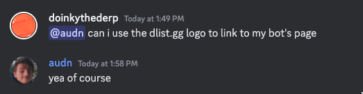

# CraftServer website

To start a dev server:

```sh
pnpm gen-icons # first time only
pnpm dev
```

## Choosing which image element to use

Use `Image` from `astro-eleventy-img` in basic cases. If you need a context-specific constant size, switch to `@astro/image/components`. If the image must change size based on breakpoints (and it will not cause content layout shifts), use a properly configured `Picture` from `@astro/image/components`.

## Misc

Proof I can use the DList logo in the footer:

