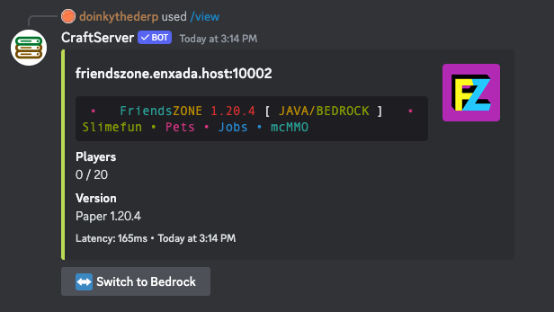
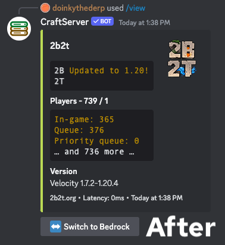
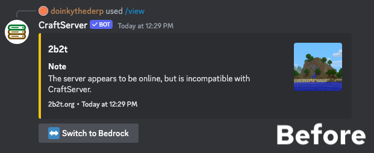

## Table of Contents

<!-- Auto generated -->

## Color approximation

CraftServer will now approximate unsupported text colors to the most similar of the eight colors that Discord supports rather than displaying them as plain text.

## Server description reliability

CraftServer's parsing of server information has been upgraded, improving support for servers that use JSON descriptions.

## Forge server reliability

CraftServer is now more reliable when viewing older Minecraft Forge servers.
